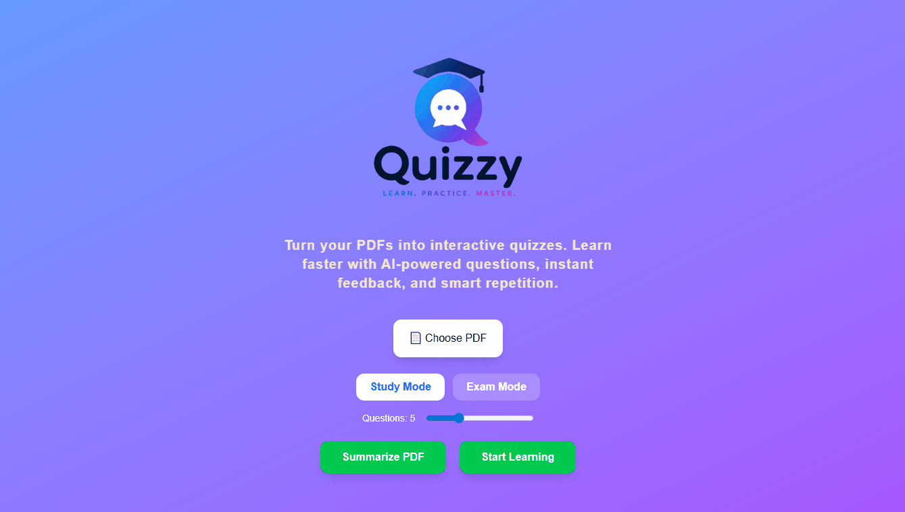
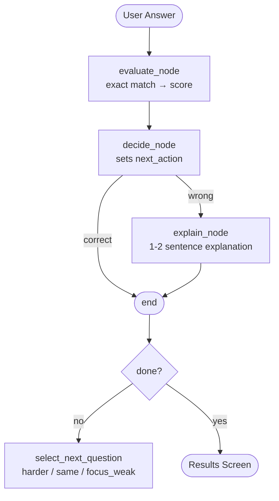

<div align="center">
  
</div>

# QuizzyAI
Turn any PDF into an adaptive quiz. Upload a document, answer questions, and the AI adjusts difficulty based on your performance.

## How it works
1. Upload a PDF → text is chunked and embedded into a vector store (FAISS)
2. Relevant chunks are retrieved via semantic search on quiz start
3. Llama 3.3 (Groq) generates questions grounded in your document
4. A LangGraph agent evaluates answers, adjusts difficulty, and explains mistakes
5. Results show your score and weak topics

## Agent Architecture


## Features
| | |
|---|---|
| **Adaptive questioning** — difficulty adjusts in real time | **PDF summarization** — key topics extracted before the quiz  |
| **Instant explanations** — wrong answers get a 1-2 sentence explanation | **Weak topic tracking** — results show which topics need review |

## Tech Stack
- **Backend**: FastAPI · LangGraph · LangChain · FAISS · Groq (Llama 3.3 70B)
- **Frontend**: Next.js 14 · Tailwind CSS · GSAP
- **RAG**: HuggingFace embeddings (all-MiniLM-L6-v2) + FAISS

## Run Locally
```bash
# Backend
cd backend && pip install -r requirements.txt
cp .env.example .env  # add GROQ_API_KEY and HF_API_KEY
uvicorn app.main:app --reload

# Frontend
cd frontend && npm install && npm run dev
```
