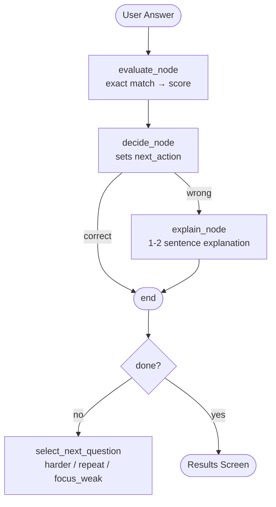

## Demo


# QuizzyAI

Turn any PDF into an adaptive quiz. Upload a document, answer questions, 
and the AI adjusts difficulty based on your performance.

## How it works

1. Upload a PDF → text is chunked and embedded into a vector store (FAISS)
2. On quiz start, relevant chunks are retrieved via semantic search
3. An LLM (Llama 3.3 via Groq) generates questions grounded in your document
4. A LangGraph agent evaluates each answer, adjusts difficulty, and explains mistakes
5. Results show your score and weak topics

## Tech stack

- **Backend**: FastAPI, LangGraph, LangChain, FAISS, Groq (Llama 3.3 70B)
- **Frontend**: Next.js 14, Tailwind CSS, GSAP
- **RAG**: HuggingFace embeddings (all-MiniLM-L6-v2) + FAISS vector search

## Features

- **PDF summarization** — before the quiz starts, the AI summarizes 
  the key topics it detected in your document
- **Adaptive questioning** — difficulty adjusts based on your answers
- **Instant explanations** — wrong answers get a concise 1-2 sentence explanation
- **Weak topic tracking** — results show which topics need more review

## Run locally

```bash
# Backend
cd backend
pip install -r requirements.txt
cp .env.example .env   # add your GROQ_API_KEY
uvicorn app.main:app --reload

# Frontend
cd frontend
npm install
npm run dev
```

## Agent Architecture




> LangGraph compiles this into a stateful graph. Each node receives the full
> `LearningState` dict and returns only the fields it modifies.

